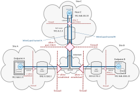

# Hub and Spoke

Automating Deployment Hub and Spoke WireGuard Configuration. [About Topology Hub and Spoke](https://www.procustodibus.com/blog/2020/11/wireguard-hub-and-spoke-config/).

> diagram from https://www.procustodibus.com/blog/2020/11/wireguard-hub-and-spoke-config/

## Requirements

Target nodes:

- VPS with ssh access, >= 1CPU, >= 512Mb (tested on Ubuntu 22.04, 64bit)
- VPS with ssh access, >= 1CPU, >= 512Mb (tested on Ubuntu 22.04, 64bit)
- VPS with ssh access, >= 1CPU, >= 512Mb (tested on Ubuntu 22.04, 64bit)

Local machine:

- Linux machine with ansible installed

## Instruction

1. Activate python environment and install if need requirements 
        
        python3 -m venv ../venv
        source ../venv/bin/activate
        pip install -r ../requirements.txt

2. Clone and edit inventory.yml

        cp inventory.yml.dist inventory.yml
        editor inventory.yml

3. Up topology via ansible playbook

        ansible-playbook -i inventory.yml up.yml

4. Check if all corrects

        ansible -i inventory.yml endpoint_a -m shell -a "ping -c 5 {{ hostvars['endpoint_b']['wg_address'].split('/')[0] }}"
        ansible -i inventory.yml endpoint_b -m shell -a "ping -c 5 {{ hostvars['endpoint_a']['wg_address'].split('/')[0] }}"

5. Play with topology if need

6. Down topology via ansible playbook

        ansible-playbook -i inventory.yml down.yml
